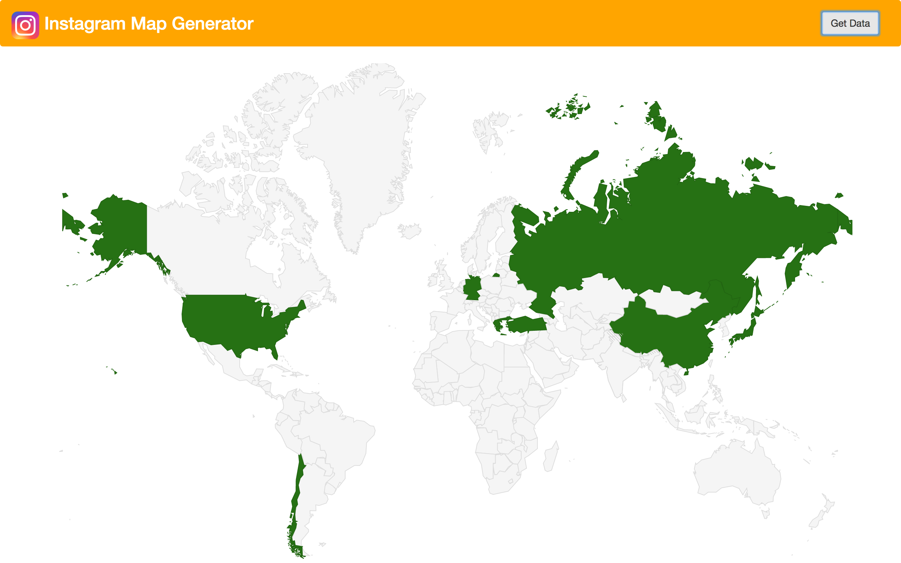

# InstagramMapGenerator
Angular4 web application which generates a **Visited Countries** map using Instagram media locations.
### How it works
The locations of the most recent Instagram media items are retrieved. Using the GeoName service, each location is mapped to a country code. This code is used to render the Google Maps GeoChart of countries.

## Setup
1. Clone/Download/Fork project.
2. Create [Instagram](https://www.instagram.com/developer/authentication/), [Google](https://developers.google.com/maps/documentation/javascript/get-api-key) and [GeoName](http://www.geonames.org/export/web-services.html) tokens.
3. Rename `config.example.ts` to `config.ts` and replace the service tokens. 
4. Run `npm install` in the root folder of the project.
5. Run `npm start` in the root folder of the project.
6. Open http://localhost:4200/
